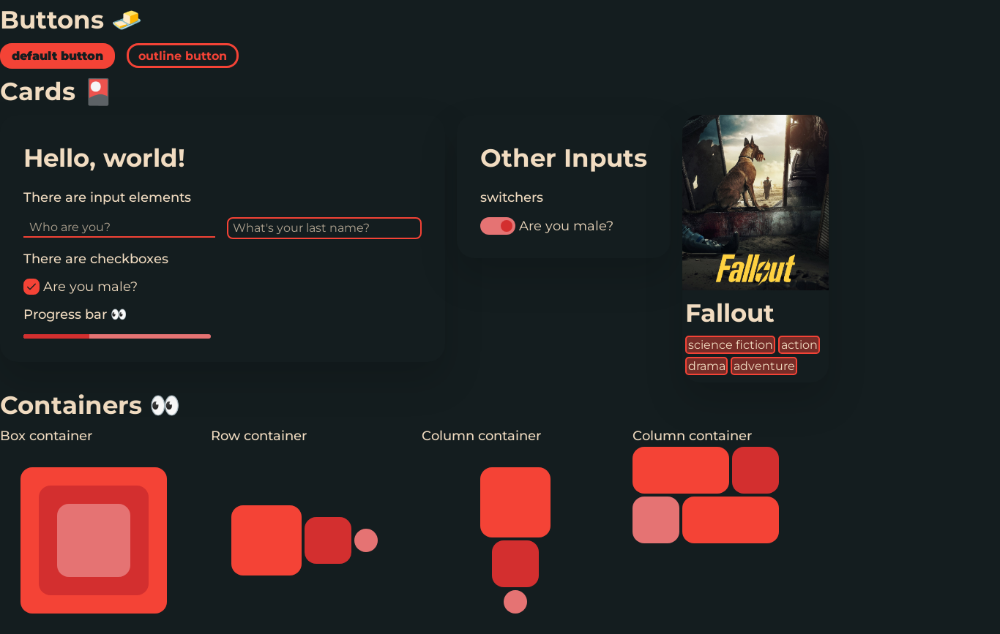

# HappyX-UI
### HappyX UI library

This library was inspired by Jetpack Compose. It contains components that allow you to efficiently and quickly create an application.

## TODO 🏁
### Simple Components
- [x] `Button`, `OutlineButton`;
- [x] `Input`, `OutlineInput`, `Checkbox`;
- [x] `Surface`;
- [x] `Column`, `Row`;
- [x] `Progress`;
- [x] `Text`;
- [x] `Image` (default + svg support);
- [x] `Card`;
- [x] `Box` (container with child position absolute);
- [x] `Grid`;
- [ ] `Slider` (range slider);
- [ ] `Stepper` (number changer);
- [ ] `Tag` (for content);
- [ ] `Tooltip`;
- [x] `Switcher`;
- [x] `ChildModifier` (applies modifier to all children (not recursive));

### Complex Components
- [ ] `Breadcrumb` (page navigation);
- [ ] `Dropdown` (dropdown menu);
- [ ] `BottomNavigation`;
- [ ] `TabNavigation`;
- [ ] `Pagination`;
- [ ] `Tree`;

## Example 👀

